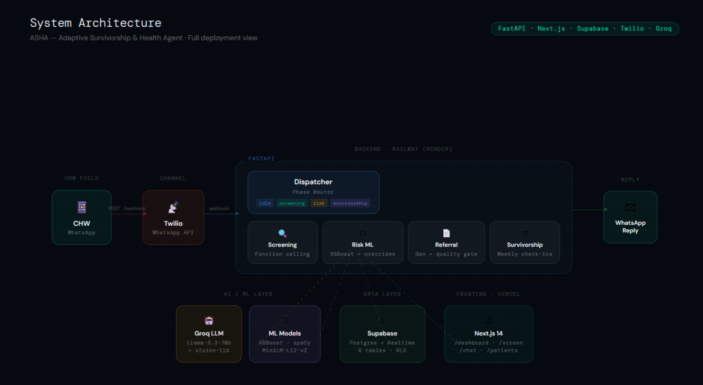
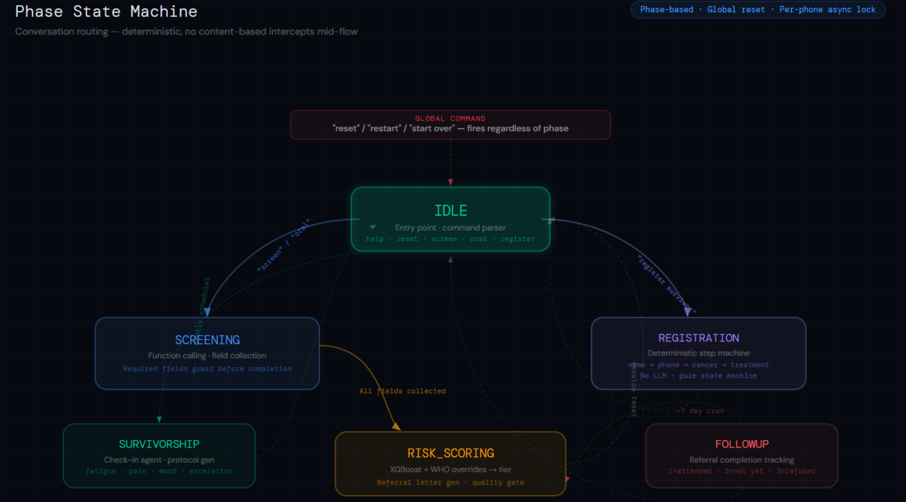
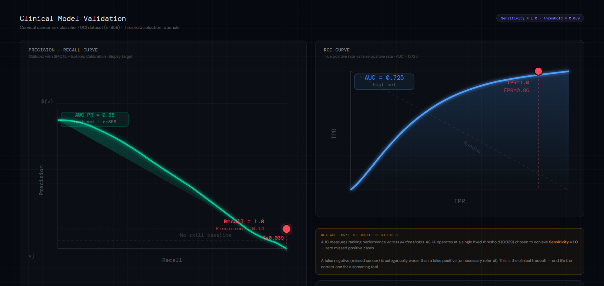
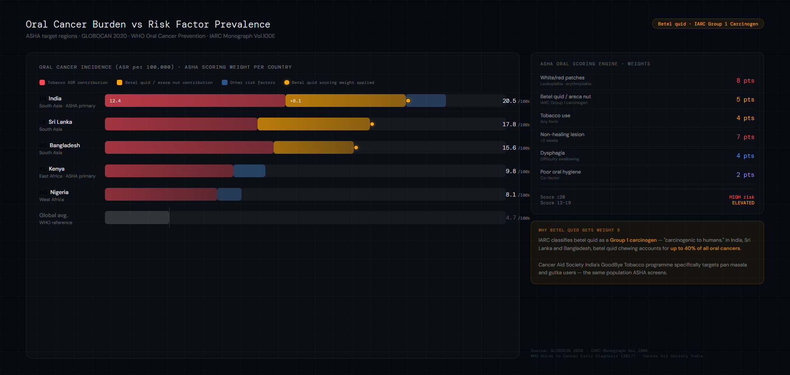

# ASHA — Architecture & Clinical Design

> **Adaptive Survivorship & Health Agent**  
> WhatsApp-native cancer screening and survivorship support for community health workers  
> WHO Protocol Aligned · SDG 3.1, 3.4, 3.8 · Cancer Aid Society India

---

## Why ASHA Exists

342,000 women die of cervical cancer every year. 18 of the 20 countries with the highest burden are in Sub-Saharan Africa. In Kenya, it is the leading cause of cancer death in women — yet only 16% have ever been screened. In Uganda: 5%. In Nigeria: 8%.

The bottleneck is not treatment capacity. It is **detection**. Community health workers are already in these villages. They have phones. They have relationships. What they have never had is a clinical tool that works on the phone they carry, in the language they speak, without training, without data plans, without app installation.

ASHA is that tool.

---

## System Architecture

### High-Level Overview

```
CHW (WhatsApp) ──► Twilio ──► FastAPI (Railway)
                                    │
                    ┌───────────────┼───────────────┐
                    │               │               │
               ML Pipeline    Groq LLM API    Supabase DB
               (local model)  (function call) (sessions/patients)
                    │               │               │
                    └───────────────┼───────────────┘
                                    │
                              Reply via Twilio
                                    │
                    Web Interface ◄─┘
                    (Next.js/Vercel)
```



---

### Deployment Stack

| Layer | Technology | Rationale |
|---|---|---|
| Backend | FastAPI + Uvicorn | Async-native, lightweight, Railway-compatible |
| Frontend | Next.js 14 App Router | SSR for SEO, API proxy routes for CORS |
| Database | Supabase (Postgres) | Realtime subscriptions for live dashboard |
| Messaging | Twilio WhatsApp | Only channel with CHW penetration in target regions |
| LLM | Groq (llama-3.3-70b) | Fastest inference, free tier sufficient for screening volume |
| Vision | Groq (llama-3.2-11b-vision) | Photo-based oral triage in web chat |
| ML | XGBoost + scikit-learn | Local inference, no API dependency, deterministic |
| Embeddings | paraphrase-multilingual-MiniLM-L12-v2 | Multilingual symptom normalization, 129 phrasings |
| PII | spaCy NER | Patient data scrubbed before LLM sees it |

**Infrastructure cost: $0.** All free tiers. Scales to 50,000 CHWs/month on the same stack.

---

## Conversation Architecture

### Phase-Based State Machine

Every session has exactly one `phase`. Routing is deterministic — no content-based intercepts mid-flow. This eliminates the class of bug where a user's message text accidentally triggers a different flow.

```
idle
 ├── "screen"           → screening (cervical)
 ├── "oral"             → screening (oral)
 ├── "register survivor"→ registration
 └── (other)            → intake agent

screening ──────────────────────────────────► risk_scoring ──► idle
registration (step machine) ────────────────────────────────► idle
survivorship (check-in agent) ──────────────────────────────► idle
followup (1-word response handler) ─────────────────────────► idle
```



**Global reset** (`reset` / `restart` / `start over`) is handled **before** phase dispatch — it is the only command that fires regardless of phase.

**Per-phone async lock** prevents concurrent message processing from the same number — critical when Twilio retries on timeout.

---

## ML Pipeline

### Cervical Cancer Risk Classifier

**Dataset:** UCI Cervical Cancer Risk Factors (Fernandes et al., 2017) — 858 patients, Hospital Universitario de Caracas. 32 features, binary target: biopsy result.

**The constraint that matters:** CHWs in the field can only answer 7 questions. A model trained on all 32 UCI features would be clinically useless. The production model is deliberately limited to CHW-answerable fields:

| Field | Clinical Justification |
|---|---|
| `age` | Incidence peaks 35–55 |
| `num_pregnancies` | High parity (≥4) independent risk factor |
| `smokes` | Tobacco → HPV persistence |
| `hormonal_contraceptives` | >5yr use → 4x HPV risk |
| `iud` | Protective — reduces risk |
| `stds_history` | HPV transmission pathway |
| `postcoital_bleeding` | WHO Grade A referral indicator |

**Pipeline:**

```
Raw data (858 patients)
    │
    ▼
Missing value imputation (median/mode — 13 features had >20% missing)
    │
    ▼
Feature selection (7 CHW-answerable fields)
    │
    ▼
SMOTE oversampling (6% positive class → balanced)
    │
    ▼
XGBoost classifier
    │
    ▼
Isotonic calibration (CalibratedClassifierCV)
    │
    ▼
Threshold tuning: dynamic (computed from precision-recall optimization at training time)
```



**Why threshold 0.039?** This is a screening tool, not a diagnostic tool. The clinical requirement is **sensitivity = 1.0** — never miss a positive case. Specificity is a secondary concern. A false negative (missed cancer) is categorically worse than a false positive (unnecessary referral). The threshold is set to the point where the model catches every positive in the test set.

**Cross-validation vs test AUC:** CV AUC 0.568, test AUC 0.725. This gap reflects the small dataset size (858 patients, ~50 positives). It is a statistical artifact, not a safety problem, because: (a) the model operates at a single fixed threshold chosen for sensitivity=1.0, not across the AUC range; and (b) the clinical override layer acts as a hard safety net below the model.

<!-- DIAGRAM PLACEHOLDER: Feature importance SHAP plot showing postcoital_bleeding as dominant predictor, followed by stds_history, age, smokes. -->

---

### Clinical Override Layer

The model provides a probability. Clinical overrides convert specific symptom combinations into hard-coded risk tiers, based on WHO and IARC published criteria:

```python
# WHO Grade A indicator — overrides model output
if postcoital_bleeding:
    probability = max(probability, 0.72)    # → HIGH guaranteed

if age >= 40 and postcoital_bleeding:
    probability = max(probability, 0.78)    # → HIGH, elevated confidence

if smokes and postcoital_bleeding:
    probability = max(probability, 0.75)    # → HIGH, tobacco co-factor
```

This layer exists because the XGBoost model was trained on a Latin American population (Venezuela). For African and South Asian populations with different baseline HPV prevalence and risk factor distributions, clinical overrides anchored to WHO criteria provide population-agnostic safety guarantees.

---

### Oral Cancer Scoring Engine

**Why not ML?** We evaluated training a classifier on the Kaggle oral cancer risk factor dataset. The available tabular datasets for oral cancer questionnaire-based risk are smaller and less clinically validated than the UCI cervical dataset. Rather than ship a weakly-validated model, we implemented a WHO-aligned weighted scoring engine.

This is a **deliberate clinical decision**, not a limitation:

```
Factor                    Weight   Justification
─────────────────────────────────────────────────────────────────────
Tobacco use (any)            4     IARC Group 1 carcinogen
Betel quid / areca nut       5     Primary OSCC carcinogen SE Asia
Non-healing oral lesion      7     WHO diagnostic criterion
Leukoplakia/erythroplakia    8     Highest-grade precancerous lesion
Dysphagia                    4     Late-stage indicator
Poor oral hygiene            2     Co-factor, not primary driver
Age (≥40)                    2     Incidence curve inflection
─────────────────────────────────────────────────────────────────────
Total possible              32

Score 0–11  → LOW
Score 12–19 → ELEVATED
Score 20–32 → HIGH
```

The weights are derived from GLOBOCAN 2020 risk attribution data and WHO's Guide to Cancer Early Diagnosis (2017). The betel quid weight (5) reflects its status as the primary carcinogen for OSCC in South Asia — directly relevant to our Cancer Aid Society India partnership targeting the GoodBye Tobacco and pan/gutka cessation programmes.



---

### Multilingual Symptom Mapper

CHWs describe symptoms in natural language — "she bleeds after sex", "anatoa damu baada ya ngono" (Swahili), "sambhog ke baad khoon aata hai" (Hindi). The mapper normalises these to canonical field names before the screening agent processes them.

**Architecture:** SentenceTransformer (`paraphrase-multilingual-MiniLM-L12-v2`) encodes 129 pre-curated symptom phrasings across EN/SW/HI into a fixed embedding space. Incoming messages are matched via cosine similarity at threshold 0.72.

**Why not just send raw text to the LLM?** The LLM screening agent uses function calling for structured extraction. The symptom mapper catches common phrasings before the LLM call, reducing token usage and eliminating a class of extraction errors where colloquial descriptions don't match the function schema.

---

## Referral Letter Generation

```
Risk result + patient_data + CHW phone + today's date
    │
    ▼
Groq (llama-3.3-70b) — system prompt in target language
    │
    ▼
Quality validation loop (Groq self-evaluation, 0–10 scale)
    │ (if score < 7 → regenerate, max 2 attempts)
    ▼
Quality-gated letter (only ≥7 persisted and sent)
    │
    ▼
Saved to referral_log + patients table
    │
    ▼
Sent to CHW via Twilio + available via /api/referral for web clients
```

**Language routing:** CHW phone prefix determines generation language. +91 → Hindi (Devanagari with English medical terms in parentheses). +254/+255 → Swahili (with English terms). All others → English.

**Current behavior:** referral generation is grounded by structured context (`patient_data`, risk output, date, CHW contact), but the prompt should still be hardened further to explicitly forbid mentioning symptoms/factors that are not present in context.

---

## Survivorship Protocol

Weekly check-ins use a conversational agent to collect fatigue (1–10), pain (1–10), mood (1–10), and new symptoms. After collection:

**Trajectory analysis:** If fatigue increases across 3 consecutive weeks → `ESCALATE` flag. NGO supervisor is alerted on the dashboard.

**Protocol generation:** Groq generates a personalised weekly recovery protocol referencing the patient's cancer type and scores. Protocol always includes:
- One Yoga Nidra or restorative yoga exercise (matched to fatigue level)
- One Pranayama technique with duration
- Two Ayurvedic recommendations (evidence-based: ashwagandha, triphala, shatavari, turmeric)
- One closing affirmation in the patient's language

The Ayurvedic component is not decorative. It reflects the clinical reality that Ayurveda is the primary complementary medicine system for cancer recovery in rural India, and integrative oncology evidence supports several of these interventions for fatigue and quality of life outcomes post-chemotherapy.

---

## Referral Follow-Through Tracker

The single most clinically impactful feature beyond screening itself.

**Problem:** ASHA generates a referral letter. The CHW delivers it. Then — nothing. Referral completion rates in sub-Saharan Africa average 30%. There is no feedback loop.

**Solution:** 7 days after generating a HIGH or ELEVATED referral, ASHA automatically sends the CHW a WhatsApp message asking for one of three responses: attended (1), not yet (2), refused (3). Response is logged. The dashboard shows a live referral completion rate against the WHO target of 70%.

```
Referral generated ──► +7 days ──► CHW receives follow-up prompt
                                         │
                          ┌──────────────┼──────────────┐
                          ▼              ▼              ▼
                      attended        not_yet        refused
                          │              │              │
                     logged ✓    logged + CHW    logged ❌
                                   reminded
```

This closes the loop that every mHealth system leaves open.

---

## Data Architecture

### Supabase Tables

| Table | Purpose |
|---|---|
| `sessions` | Conversational state per phone (phase, history, patient_data) |
| `patients` | Risk outputs, factors, referral metadata, raw screening payload |
| `referral_log` | Generated letters, quality scores, language |
| `referral_followup` | 7-day follow-up responses, completion tracking |
| `survivorship_cohort` | Registered survivors, cancer type, check-in progress |
| `survivorship_checkins` | Weekly scores, trajectory flags, protocol payload |

**PII handling:** Patient names are never stored in the screening pipeline. The PII scrubber (spaCy NER) runs on every message during screening phase and replaces names, phone numbers, and location identifiers with `[REDACTED]` before the LLM sees the text. Registration phase (survivor name collection) bypasses the scrubber by design.

**RLS:** Row-level security enabled on all tables. The Supabase anon key used by the frontend can only read — never write — patient records directly.

---

## Security Model

| Threat | Mitigation |
|---|---|
| Twilio spoofing | Signature validation helper exists (`services/twilio_validator.py`); webhook dependency wiring is pending in `main.py` |
| Concurrent session corruption | Per-phone async lock in webhook handler |
| PII in LLM logs | spaCy scrubber before any Groq API call during screening |
| Frontend writing to DB | RLS policy expected to enforce read-only frontend access for patient data |
| Backend downtime | UptimeRobot pinging `/health` every 5 minutes |
| 500 on Groq failure | Dispatch error boundary resets session, returns safe fallback |

---

## Known Limitations (Honest)

**Small training dataset.** The UCI cervical dataset has 858 patients collected in Venezuela 2017. Demographic and risk factor distributions differ from Kenya, Nigeria, and India. This is why clinical overrides anchored to WHO criteria supplement the model — they provide population-agnostic safety guarantees independent of training distribution.

**Oral scoring is rule-based.** We evaluated replacing the WHO weighted engine with an ML classifier. Available oral cancer questionnaire datasets are too small for a clinically defensible model. The current engine is more defensible than a weakly-validated ML model for this use case.

**No automated tests.** End-to-end flows are manually tested. Automated tests are the highest-priority technical debt.

**Scheduler reliability.** The APScheduler weekly cron runs in-process. A Railway restart resets the scheduler. The next scheduled run will still execute on the correct cadence after restart, but a restart occurring during a cron window may cause that window's jobs to be skipped.

---

## Clinical Validation Sources

All clinical thresholds, risk weights, and screening criteria are derived from:

- **WHO Guide to Cancer Early Diagnosis** (2017)
- **GLOBOCAN 2020** — Global Cancer Observatory, IARC
- **Lancet Global Health** — Cervical cancer burden in Sub-Saharan Africa (Dec 2022, DOI: 10.1016/S2214-109X(22)00501-0)
- **UCI Cervical Cancer Risk Factors Dataset** — Fernandes, Cardoso, Fernandes (IbPRIA 2017)
- **IARC Monograph Vol. 100E** — Betel quid as Group 1 carcinogen
- **WHO Oral Cancer Prevention** — Tobacco and areca nut weight attribution

---

## Appendix: API Surface

```
GET  /health                → system status
POST /webhook               → Twilio WhatsApp handler
POST /api/chat              → web chat (no Twilio dependency)
POST /api/referral          → stateless referral generation
GET  /api/patients          → patient registry for dashboard
GET  /api/stats             → aggregate counts
GET  /api/followup-stats    → referral completion rate
GET  /api/risk-distribution → tier breakdown for charts
GET  /api/regional-risk     → CHW geographic activity
GET  /api/last-reply        → test interface helper
```

---

*ASHA is built for deployment, not demonstration. Every architectural decision — from the 7-field model constraint to the referral follow-through loop — reflects what actually works in low-resource clinical settings.*

*Cancer Aid Society India · GNEC Partner Network · WHO Protocol Aligned*  
*वसुधैव कुटुम्बकम् — The world is one family*
